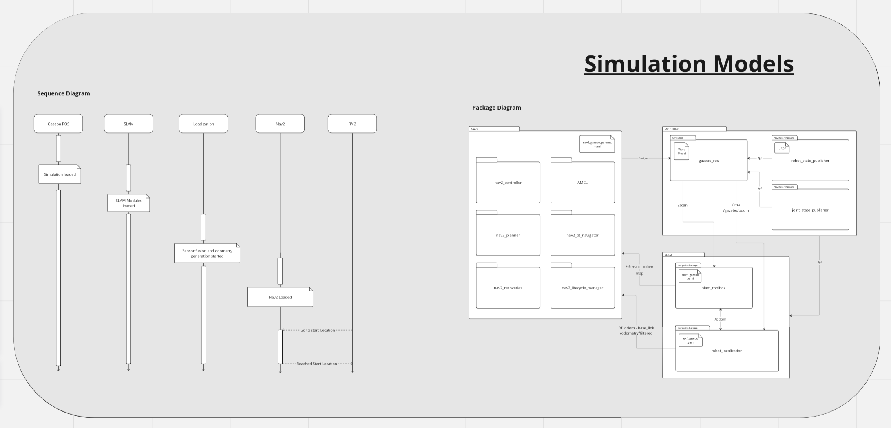
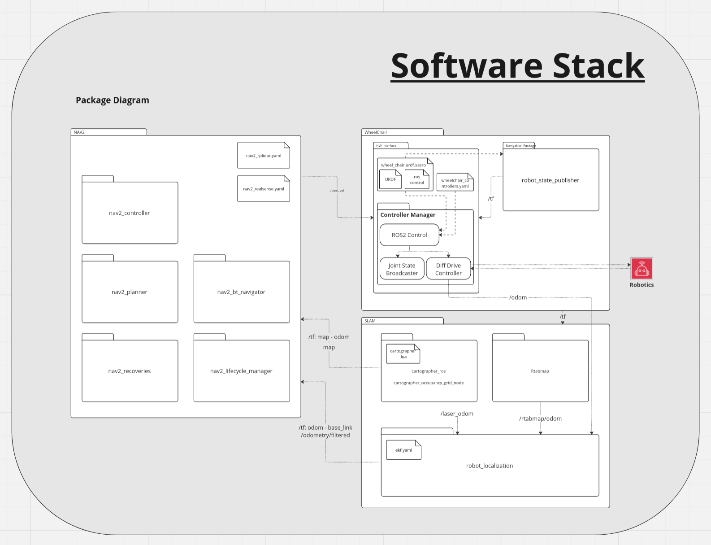

# Smart WheelChair

# Team Members:

- Prof. Reza Monferedi

- Tej Kiran

# Project Overview:

## Introduction
Motorized wheel chairs are ubiqutous everyewhere. A smart obstacle monitoring and avoidance system can make these chairs more accessible and useful to people with cerebral palsey. The system uses ROS navigaiton stack to anticeipate the path the wheel chair required to follow and keep monitoring for the obstacles. If user makes a mistake in the control input, the system can kick into action and correct the course or stops the chair from colliding with obstacles.

## Purpose
To build a smart motion aniticiplation and correction system using ROS2 and Depth sensors that can be retro fitted to commercially available motorized wheel chairs.

## Design
### Simulation model


### Device Software Stack


## Technologies and Libraries
The module will be developed using the following technologies:
- Programming Language: C++11/14
- Libraries: ROS2 Gazebo ( Apache v2.0 ), ROS2 Nav2 ( SPDX-ID - Various Licenses ), 
- Realsense SDK & ROS2 package
- RPLIdar ROS2 package 
- ROS2 Cartographer for 2D mapping( GPL v2.1 ).
- Rtabmap for 3D mapping
- Build System: CMakes
- Testing Framework: Google Test
- Static Code Analysis: cppcheck

## ROS REP's
The following REP's are referred:
- ROS REP105
- ROS REP103


## Install build dependancies
```bash
# Install ROS Humble desktop
https://docs.ros.org/en/humble/Installation/Ubuntu-Install-Debians.html

# Install Hardware Interfaces
sudo apt install ros-humble-hardware-interface

# Install colcon packages
sudo apt install python3-colcon-common-extensions

----------------------------------------------------
# Note : The wheel_chair library depends on the serial-ros2 package for serial communication.

# clone the  serial-ros2 from the below repository into the "/src" directory
git clone https://github.com/RoverRobotics-forks/serial-ros2

# The serial-ros2 library need to be modified for linking with shared library by adding the following flag to "./src/serial-ros2/cmakeLists.txt"
target_compile_options(${PROJECT_NAME} PRIVATE -fPIC)

# For example add the above line under the 'add_library' section as shown below

# add_library(${PROJECT_NAME}
#     src/serial.cc
#     include/serial/serial.h
#     include/serial/v8stdint.h
# )
target_compile_options(${PROJECT_NAME} PRIVATE -fPIC)
----------------------------------------------------

```

## How to build
``` bash
# Cloning the repository
  git clone <repo-link>
# Run the build 
  colcon build
  
#
```

## How to run the simulation
```bash
# source repositories
source /opt/ros/humble/setup.bash

# source workspace
source ./install/setup.bash

# run simulation launch file
ros2 run wheel_chair_sim gazebo_nav.launch.py
```


## How to run on hardware
```bash
# source repositories
source /opt/ros/humble/setup.bash

# source workspace
source ./install/setup.bash

# run launch file for lidar
ros2 run wheel_chair wheelchair_odom.launch.py two_d_mode:=true
ros2 run wheel_chair wheelchair_nav.launch.py

# run launch file for depth camera
ros2 run wheel_chair wheelchair_odom.launch.py three_d_mode:=true
ros2 run wheel_chair wheelchair_nav.launch.py
```

## Miscellaneous points
#### 1. To enable multi pc communication of ROS2
```
sudo ufw allow in proto udp from 10.42.0.1/24
```

#### 2. Procedure to install Cartographer
```
sudo apt install ros-galactic-cartographer
sudo apt install ros-galactic-cartographer-ros
```
